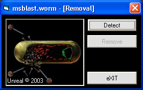



## msblast\.worm remover

### Description

This is a remover for the known worm msblast. This is not a professional msblast remover so please do not criticise (bad) my work and do not compare it with other (pro) removers. Please feel free to leave comments, I really wanna know what you think about my work. Oh, and if you find this usefull please vote for it!
 
### More Info
 

             |
---                |---
**Submitted On**   |2003-10-20 15:30:06
**By**             |[Kyriakos Nicola](https://github.com/Planet-Source-Code/PSCIndex/blob/master/ByAuthor/kyriakos-nicola.md)
**Level**          |Intermediate
**User Rating**    |5.0 (10 globes from 2 users)
**Compatibility**  |VB 5\.0, VB 6\.0, VB Script
**Category**       |[Miscellaneous](https://github.com/Planet-Source-Code/PSCIndex/blob/master/ByCategory/miscellaneous__1-1.md)
**World**          |[Visual Basic](https://github.com/Planet-Source-Code/PSCIndex/blob/master/ByWorld/visual-basic.md)
**Archive File**   |[msblast\_wo16612710202003\.zip](https://github.com/Planet-Source-Code/kyriakos-nicola-msblast-worm-remover__1-49352/archive/master.zip)

